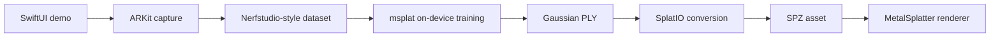

# Voxelio iOS Gaussian Splatting Demo

A small, source-transparent iOS reference project for capturing a scene with
ARKit, training a 3D Gaussian Splat on device with msplat, and rendering the
result in real time with MetalSplatter.

> Prefer using the finished scanning workflow instead of building it?
> [Download Voxelio on the App Store](https://www.voxelio.app/go/github).

> [!IMPORTANT]
> This repository is under active development. The end-to-end flow is implemented,
> but capture quality, memory use, and training time still need validation
> across more physical devices.

## Demo

<p align="center">
  
</p>

<p align="center">
  <a href="./media/voxelio-ios-3dgs-demo.webm?raw=1"><strong>Watch the full-quality WebM</strong></a>
</p>

## What the demo does

1. Captures camera images, intrinsics, and poses with ARKit.
2. Samples an optional LiDAR depth seed cloud when scene depth is available.
3. Writes a Nerfstudio-style dataset entirely on device.
4. Trains a Gaussian Splat locally with msplat at a selectable 1K–5K target.
5. Saves a resumable checkpoint and converts the trained PLY to SPZ.
6. Renders the SPZ at interactive frame rates with MetalSplatter.
7. Keeps every project in the app's Documents directory for later viewing or
   sharing.

## Goals

- Keep the complete Gaussian pipeline inspectable from Swift through Metal.
- Demonstrate a focused SwiftUI and ARKit architecture suitable for learning.
- Store scans locally and make training progress understandable.
- Export a compact SPZ result that can be shared from the app.
- Avoid analytics, accounts, cloud processing, and proprietary app services.

## Architecture



The implementation is intentionally split by responsibility:

| Folder | Responsibility |
| --- | --- |
| `Capture/` | ARKit session, frame selection, JPEG/pose writing, and LiDAR seed sampling |
| `Models/` | Persistent local project metadata and package lifecycle |
| `Training/` | msplat configuration, progress previews, checkpoints, and SPZ conversion |
| `Viewer/` | MetalSplatter loading, orbit, zoom, reset, and reveal animation |
| `Views/` | Project detail, training controls, export, and full-screen viewer |

## On-device data schema

Each capture becomes a self-contained package under
`Documents/GaussianSplattingDemo/`:

```text
<UUID>.gaussiansplat/
├── scan.json                 # Demo metadata and processing state
├── transforms.json           # Camera intrinsics and camera-to-world poses
├── thumbnail.jpg             # First accepted camera view
├── images/
│   ├── frame_00000.jpg
│   └── ...
├── points3D.ply              # Optional ARKit scene-depth seed cloud
├── training-2000.ckpt        # Resumable msplat state for the completed target
└── trained-2000.spz          # Shareable Gaussian Splat result
```

`transforms.json` uses the camera fields expected by msplat's
`GaussianDataset`: `camera_model`, `fl_x`, `fl_y`, `cx`, `cy`, `w`, `h`, and a
`frames` array containing `file_path` and a 4×4 `transform_matrix`.

## Run it

1. Open `3DGS Demo.xcodeproj` in Xcode.
2. Select your development team and a physical iPhone or iPad.
3. Run the `3DGS Demo` scheme and allow camera access.
4. Tap **New capture**, start recording, and move steadily around one subject.
5. Finish after at least five saved views, choose a training target, and tap
   **Start training**.
6. Keep the app open while training. When it finishes, orbit or pinch the result
   in the viewer and use **Share SPZ** to export it.

Start with the 1K target while testing the pipeline. A wider range of stable,
overlapping viewpoints generally produces a more useful result than the
five-view technical minimum.

## Dependencies

| Component | Purpose | Source |
| --- | --- | --- |
| SwiftUI + ARKit | App UI and camera tracking | Apple system frameworks |
| msplat | On-device 3DGS training | [`Voxelio-app/msplat`](https://github.com/Voxelio-app/msplat) |
| MetalSplatter | Real-time Gaussian rendering | [`Voxelio-app/MetalSplatter`](https://github.com/Voxelio-app/MetalSplatter) |
| SplatIO | PLY/SPZ loading and conversion | Included with MetalSplatter |

Direct package dependencies are pinned to reviewed commit revisions. Transitive
versions are recorded in `Package.resolved`.

## Requirements

- An iPhone or iPad running iOS 18 or later.
- An Xcode release with Swift 6.1 package support.
- A physical device for camera capture and performance validation.

Simulator builds are useful for UI development, but cannot validate the real
ARKit capture and on-device training experience.

## Project status

- [x] Transparent source forks and dependency provenance
- [x] Source-only iOS package integration
- [x] ARKit capture and dataset writer
- [x] On-device training and checkpoint resume
- [x] Persistent local scan library
- [x] MetalSplatter viewer and SPZ export
- [ ] Architecture artwork and sample scan

## License

Voxelio's original code in this repository is source-available under the
[PolyForm Noncommercial License 1.0.0](LICENSE). Copyright 2026 Voxelio.

Commercial use requires a separate written license; see
[COMMERCIAL_LICENSING.md](COMMERCIAL_LICENSING.md). Third-party components keep
their original licenses as described in
[THIRD_PARTY_NOTICES.md](THIRD_PARTY_NOTICES.md).
