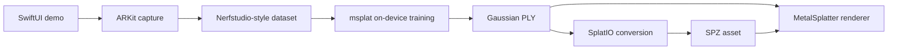

# Voxelio iOS Gaussian Splatting Demo

A small, source-transparent iOS reference project for capturing a scene with
ARKit, training a 3D Gaussian Splat on device with msplat, and rendering the
result in real time with MetalSplatter.

> [!IMPORTANT]
> This repository is under active development. The dependency foundation is
> available first; capture, training, library, and viewer flows will be added in
> documented increments.

## Goals

- Keep the complete Gaussian pipeline inspectable from Swift through Metal.
- Demonstrate a focused SwiftUI and ARKit architecture suitable for learning.
- Store scans locally and make training progress understandable.
- Export standard Gaussian PLY and SPZ files.
- Avoid analytics, accounts, cloud processing, and proprietary app services.

## Architecture

## Dependencies

| Component | Purpose | Source |
| --- | --- | --- |
| SwiftUI + ARKit | App UI and camera tracking | Apple system frameworks |
| msplat | On-device 3DGS training | [`Voxelio-app/msplat`](https://github.com/Voxelio-app/msplat) |
| MetalSplatter | Real-time Gaussian rendering | [`Voxelio-app/MetalSplatter`](https://github.com/Voxelio-app/MetalSplatter) |
| SplatIO | PLY/SPZ loading and conversion | Included with MetalSplatter |

Direct package dependencies are pinned to reviewed commit revisions. Transitive
versions are recorded in `Package.resolved`.

## Requirements

- An iPhone or iPad running iOS 18 or later.
- An Xcode release with Swift 6.1 package support.
- A physical device for camera capture and performance validation.

Simulator builds are useful for UI development, but cannot validate the real
ARKit capture and on-device training experience.

## Project status

- [x] Transparent source forks and dependency provenance
- [x] Source-only iOS package integration
- [ ] ARKit capture and dataset writer
- [ ] On-device training and checkpoint resume
- [ ] Persistent local scan library
- [ ] MetalSplatter viewer and export
- [ ] Architecture artwork and sample scan

## License

Voxelio's original code in this repository is source-available under the
[PolyForm Noncommercial License 1.0.0](LICENSE). Copyright 2026 Voxelio.

Commercial use requires a separate written license; see
[COMMERCIAL_LICENSING.md](COMMERCIAL_LICENSING.md). Third-party components keep
their original licenses as described in
[THIRD_PARTY_NOTICES.md](THIRD_PARTY_NOTICES.md).
